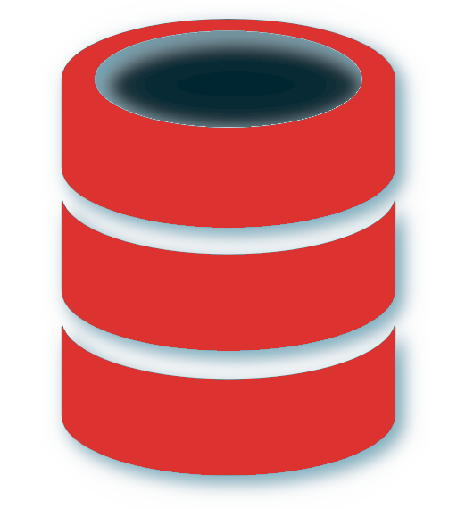
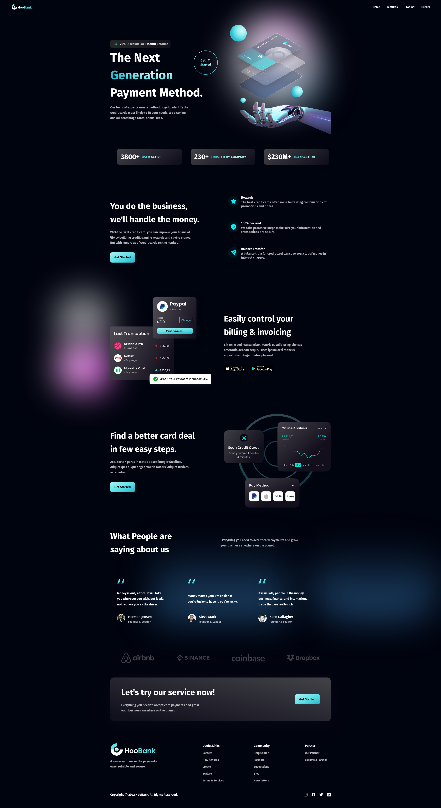
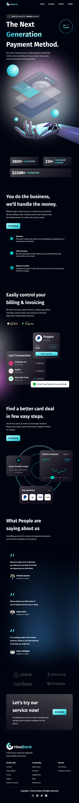
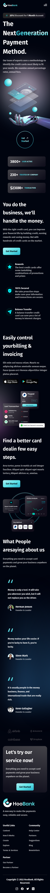

<div align="center">



# HooBank-Rescript

*Modern UI/UX website using React & Tailwind CSS written in Rescript*


</div>

## Introduction
<a href="https://rescript-lang.org">


- Fast, Simple, Fully Typed JavaScript from the Future.

</a>

<a href="https://react.dev/">


- The library for web and native user interfaces

<a href="https://tailwindcss.com/">


- Rapidly build modern websites without ever leaving your HTML

## Build and Run
```
Lifecycle scripts:
  start
    vite
  test
    vitest

Commands available via "pnpm run":
  build
    vite build
  clean
    rescript clean -with-deps
  format
    rescript format -all
  serve
    vite preview
```

## DEMO

### Desktop


### PAD


### Mobile


## Reference
- [Figma: HooBank](https://www.figma.com/file/bUGIPys15E78w9bs1l4tgS/HooBank)
- [project_hookbank](https://github.com/adrianhajdin/project_hoobank)

## LICENSE
The MIT License (MIT)

Copyright (c) 2022 Muqiu Han

Permission is hereby granted, free of charge, to any person obtaining a copy
of this software and associated documentation files (the "Software"), to deal
in the Software without restriction, including without limitation the rights
to use, copy, modify, merge, publish, distribute, sublicense, and/or sell
copies of the Software, and to permit persons to whom the Software is
furnished to do so, subject to the following conditions:

The above copyright notice and this permission notice shall be included in all
copies or substantial portions of the Software.

THE SOFTWARE IS PROVIDED "AS IS", WITHOUT WARRANTY OF ANY KIND, EXPRESS OR
IMPLIED, INCLUDING BUT NOT LIMITED TO THE WARRANTIES OF MERCHANTABILITY,
FITNESS FOR A PARTICULAR PURPOSE AND NONINFRINGEMENT. IN NO EVENT SHALL THE
AUTHORS OR COPYRIGHT HOLDERS BE LIABLE FOR ANY CLAIM, DAMAGES OR OTHER
LIABILITY, WHETHER IN AN ACTION OF CONTRACT, TORT OR OTHERWISE, ARISING FROM,
OUT OF OR IN CONNECTION WITH THE SOFTWARE OR THE USE OR OTHER DEALINGS IN THE
SOFTWARE.